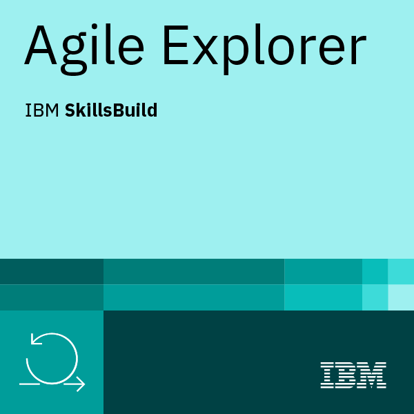
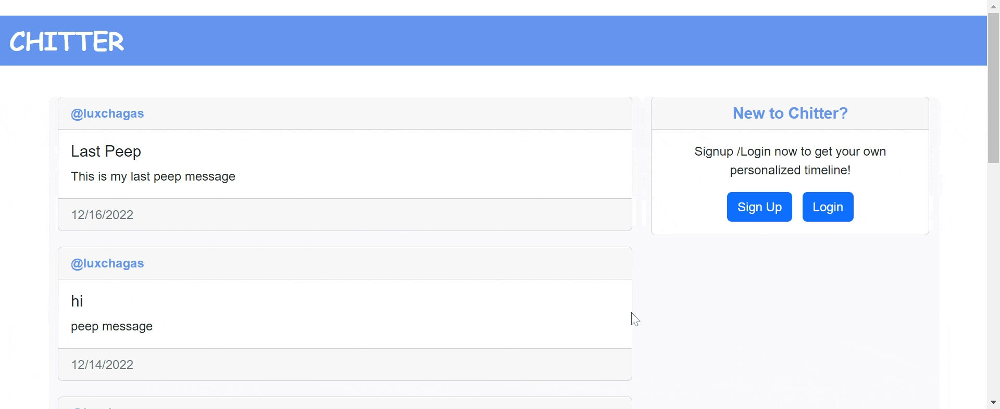
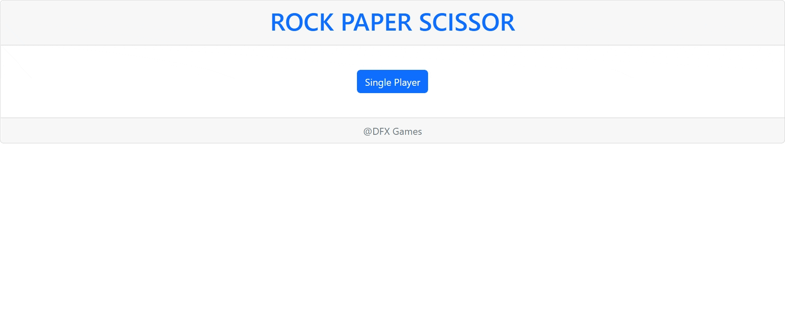

  

Hello There!! I have 2 years of Experience of being a FullStack Developer back in 2009.Last few years i worked as a PostOffice Manager in various Locations in england.Recently i have joined Digital Future as a Trainee Software Engineer and finish 12 weeks of training and gained the knowledge of the diffrent technologies/tools.

At Digital Future We have done Chanllenges to apply our knowledge toward the learning.  
	
<b>Chitter Challenge :- Full Stack Application React/Nodejs/exress/mocha/chai with TDD</b> 
<b>PRS Challenge :- Nodejs/exress/mocha/chai with TDD</b> 
<b>News Challenge :- React with TDD</b> 
<b>Scrabble Challenge :- Java with TDD</b> 
<b>Bank Challenge :- Vanila Javascript with TDD</b> 
<b>Airport Challenge :- Vanila Javascript with TDD</b> 

### Recent Projects ...

<b>Recipe App :- Full Stack Application React/Nodejs/exress/MongoDB</b> 

Recipe app where you can Add your own receipe also you can add a recipe from Jamie oliver Website

<b>Reminder App :- Full Stack Application React/Go/Gin/MongoDB</b> 

Reminder app where you can set the reminder to send it on your number with the help of Twilio

- 🔭 I’m currently working on **Book Library app SpringBoot/Java/Nodejs/SQL/React/Type script**

- 🌱 I’m currently learning **SpringBoot/SQL/Typescript**

- 😄 Pronouns: **She/Her**

 
  
    

### Feel Free to Contact me ...

	
	
	

### Languages and Tools ...
 

                   

 

  

### Profile views counter

<h1 align="center">Projects</h1>
<table bordercolor="#66b2b2">

  <tr>
      <td width="50%" valign="top">
      <h3 align="center">Twitter Clone</h3>
         
        
         
        

   
<!--      -->
  </a>
      

        
A lovely full stack application inspired by twitter!

    </td>
  </tr>
  <tr>
    <td width="50%" valign="top">
      <h3 align="center">Guardian News App</h3>
         
        
         
        

  
      

        
Enjoy Reading the Latest News!

    </td>
    <td width="50%" valign="top">
      <h3 align="center">Rock Paper Scissor Game</h3>
         
        
         
        

  
      

        
Have Fun with ROCK_PAPER_SCISSORS

    </td>
  </tr>
</table>
